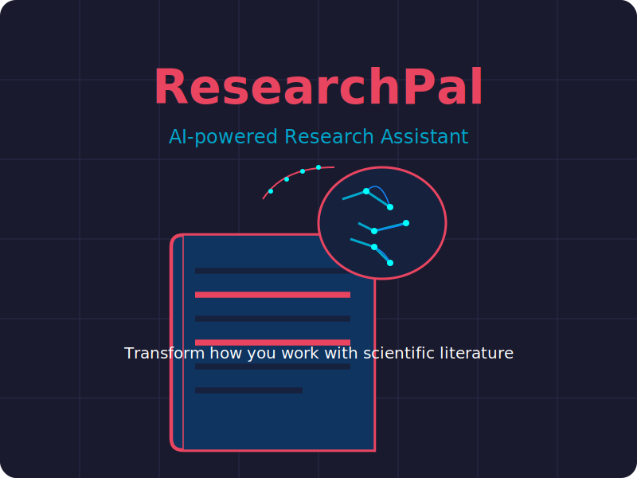

# ResearchPal 🔬📑

<div align="center">
  
  
  
</div>

<p align="center">
  
</p>

**ResearchPal** is your AI-powered research assistant for scientific literature. It helps you process, understand, and extract insights from research papers with ease.

## ✨ Features

- 📄 **Extract and summarize research papers** from PDFs
- 🔍 **Search your paper collection** by content, domain, and more
- 💡 **Generate key takeaways** and important insights automatically
- 🧠 **Discuss papers** with an AI assistant to deepen understanding
- 🧮 **Extract mathematical formulations** and model architectures
- 💻 **Generate implementation code** for described architectures
- 📝 **Create blog posts** explaining papers in accessible language
- 🌐 **Domain classification** to organize your research collection
- 📊 **Interactive interface** with customizable themes

## 🚀 Quick Start

### Installation

#### Option 1: Install from PyPI

```bash
pip install research-pal
```

#### Option 2: Install from source

```bash
git clone https://github.com/username/research-pal.git
cd research-pal
pip install -e .
```

### API Keys
ResearchPal uses LLMs for analysis. You'll need at least one of these API keys:
- [OpenAI API Key](https://platform.openai.com/account/api-keys) (for GPT models)
- [Google API Key](https://ai.google.dev/) (for Gemini models)

You can set the API keys in any of the following ways:
1. Environment variables: Set `OPENAI_API_KEY` or `GOOGLE_API_KEY`
2. Configuration file: Run `research-pal configure` to set up your API keys
3. Directly in code when using as a library: Pass keys to the `LLMInterface` constructor

### Basic Usage

Launch the interactive shell:
```bash
research-pal
```

Or configure your settings first:
```bash
research-pal configure
```

## 🧰 Commands

### Interactive Shell Commands

| Command | Description |
|---------|-------------|
| `search <query> [-n <count>]` | Search for papers in the database |
| `search domain:<domain_name>` | Search for papers in a specific research domain |
| `open <paper_id>` | Open a paper and set it as current context |
| `show <section>` | Show a section of current paper (summary, takeaways, etc.) |
| `discuss <question>` | Discuss the current paper with the AI assistant |
| `summarize <pdf_path>` | Summarize a new paper |
| `summarize <pdf_path> [--token-limit <limit>]` | Summarize with custom token limit |
| `generate code\|blog` | Generate code implementation or blog post |
| `theme <theme_name>` | Change the UI theme (cyberpunk, matrix, midnight) |

## 📚 Examples

### Summarize a paper
```bash
> summarize path/to/paper.pdf
```

### Generate implementation code
```bash
> summarize path/to/paper.pdf --code
```

### Generate a blog post
```bash
> summarize path/to/paper.pdf --blog
```

### Search for papers in a specific domain
```bash
> search domain:Reinforcement Learning
```

### Discuss a paper with the AI assistant
```bash
> open 8f7e9a1b2c
> discuss What are the limitations of this approach?
```

## 🧩 Advanced Settings

You can customize ResearchPal's behavior by editing your configuration:

```bash
research-pal configure
```

Options include:
- Default LLM model selection
- Output token limits
- Database location
- Output directory for generated files
- Theme preferences

## 🏗️ Project Structure

```
research_pal/
├── cli/                # Command-line interface
│   ├── __init__.py     
│   ├── interactive.py  # Interactive shell
│   └── main.py         # Entry point
├── core/               # Core functionality
│   ├── __init__.py
│   ├── llm_interface.py # LLM API interactions
│   ├── pdf_processor.py # PDF extraction
│   ├── prompts.py      # System prompts
│   └── summarizer.py   # Paper summarization
├── db/                 # Database management
│   ├── __init__.py
│   └── chroma_manager.py # Vector database
├── utils/              # Utilities
│   ├── __init__.py
│   ├── config.py       # Configuration handling
│   ├── display.py      # Display functions
│   └── ui_themes.py    # Advanced UI
└── tests/              # Test suite
    ├── __init__.py
    ├── conftest.py     # Test fixtures
    ├── test_llm_interface.py
    ├── test_pdf_processor.py
    ├── test_summarizer.py
    └── test_chroma_manager.py
```

## 🧪 Development and Testing

### Setting Up a Development Environment

1. Clone the repository:
   ```bash
   git clone https://github.com/username/research-pal.git
   cd research-pal
   ```

2. Create a virtual environment:
   ```bash
   python -m venv venv
   source venv/bin/activate  # On Windows: venv\Scripts\activate
   ```

3. Install in development mode:
   ```bash
   pip install -e ".[dev]"
   ```

### Running the Tests

Run the test suite to ensure everything is working correctly:

```bash
pytest
```

For more detailed test output:

```bash
pytest -v
```

For code coverage information:

```bash
pytest --cov=research_pal
```

### API Key Setup for Testing

For testing, you can use any of these methods to set up your API keys:

1. Create a `.env` file in the project root:
   ```
   OPENAI_API_KEY=your_openai_key_here
   GOOGLE_API_KEY=your_google_key_here
   ```

2. Export as environment variables in your terminal:
   ```bash
   export OPENAI_API_KEY=your_openai_key_here
   export GOOGLE_API_KEY=your_google_key_here
   ```

3. Use the configuration utility:
   ```bash
   research-pal configure
   ```

## 📋 Requirements

- Python 3.8+
- Required packages (automatically installed):
  - rich
  - click
  - httpx
  - tenacity
  - chromadb
  - pdfminer.six
  - pyyaml

## 📖 Documentation

Comprehensive documentation is available in the [docs](docs/) directory.

## 🤝 Contributing

Contributions are welcome! Check out [CONTRIBUTING.md](CONTRIBUTING.md) for guidelines.

## 📄 License

This project is licensed under the MIT License - see the [LICENSE](LICENSE) file for details.

## 🙏 Acknowledgements

- Built with [OpenAI](https://openai.com/) and [Google Gemini](https://deepmind.google/technologies/gemini/) APIs
- Uses [ChromaDB](https://www.trychroma.com/) for vector storage
- Powered by [Rich](https://github.com/Textualize/rich) for terminal UI